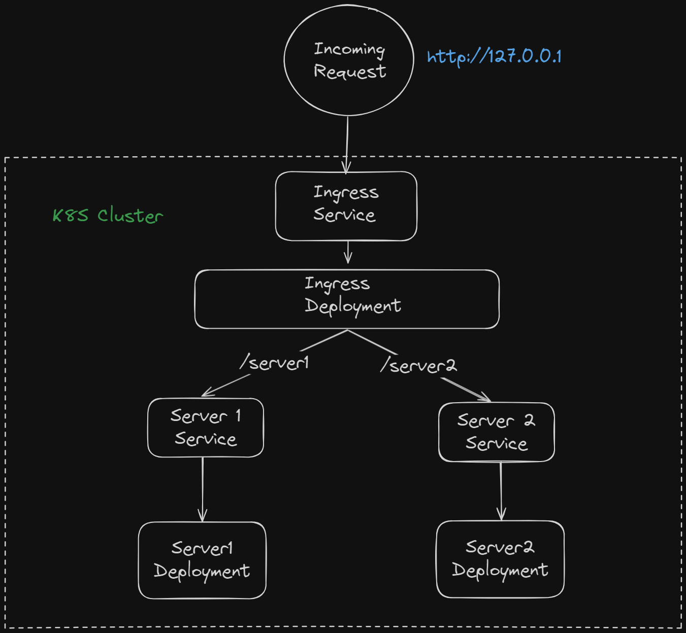
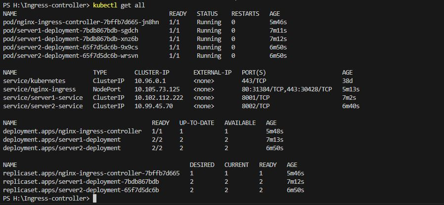

# Ingress-Kubernetes

## Understanding Kubernetes Ingress

Kubernetes ingress is a collection of routing rules that govern how external users access services running in a Kubernetes cluster. Kubernetes Ingress is used to manage external access to services running in a Kubernetes cluster. Instead of manually configuring individual services to expose them to external traffic, Ingress provides a way to manage external access to services in a more centralized and flexible manner.



Here we accessed the desired pod using ingress. The incoming request from localhost (http://127.0.0.1) is accessed through the Nginx ingress using the portname. 

http://127.0.0.1/server1 is redirected to server-01 and http://127.0.0.1/server2 is redirected to server2.

Here is the ingress resource definition file where the path of the server is set:

```bash
apiVersion: networking.k8s.io/v1
kind: Ingress
metadata:
  name: minimal-ingress
  annotations:
    nginx.ingress.kubernetes.io/rewrite-target: /
spec:
  rules:
  - http:
      paths:
      - path: /server1
        pathType: Prefix
        backend:
          service:
            name: server1-service
            port:
              number: 8001
      - path: /server2
        pathType: Prefix
        backend:
          service:
            name: server2-service
            port:
              number: 8002
```

## Implementing Nginx Ingress using minikube

### 1. Create Server-01

```bash
kubectl apply -f deployment-01.yaml
kubectl apply -f service-01.yaml
```

### 2. Create Server-02

```bash
kubectl apply -f deployment-02.yaml
kubectl apply -f service-02.yaml
```
### 3. Create Configmap for Nginx

In this ConfigMap, we defined key-value pairs where the keys represent configuration file paths, and the values represent the content of those configuration files. Typically, NGINX Ingress Controller uses these configuration files to customize its behavior, such as defining custom error pages, setting up SSL certificates, configuring rate limiting, or defining rewrite rules.

```bash
kubectl apply -f nginx-configmap.yaml
```

### 4. Create Nginx ingress

```bash
kubectl apply -f nginx-deployment.yaml
kubectl apply -f nginx-service.yaml
kubectl apply -f ingress-resource.yaml
```

### Check If the deployments and service files are running

```bash
kubectl get all
```



### Minikube tunnel 

```bash
minikube tunnel
```


### Accessing from Browser

To access server1 and server2 from local browser use 
http://127.0.0.1/server1 
http://127.0.0.1/server2


